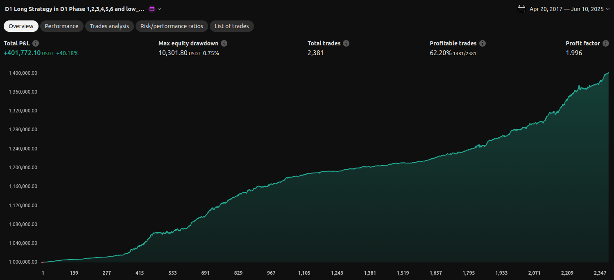
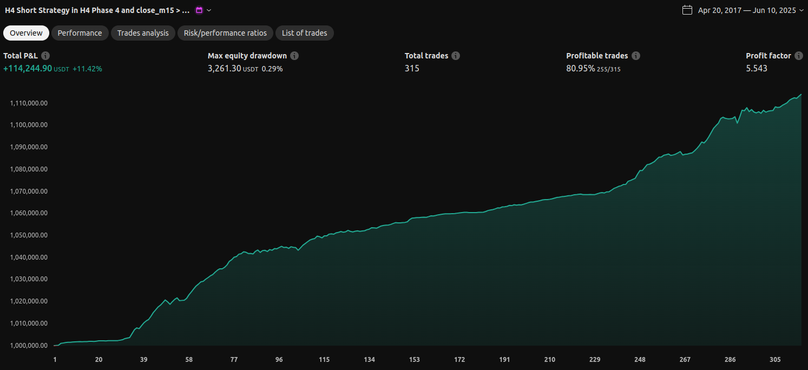

# PineCryptoStrategies

A collection of Pine Script strategies and indicators for trading, focused on M15 to D1 timeframes. Designed for cryptocurrency markets but applicable to any trading instrument, emphasizing robust, non-overoptimized approaches.

## About Us

We are seasoned trading experts with a unique methodology for developing strategies that stand the test of time. Unlike conventional approaches relying on heavy optimization and curve-fitting, our strategies are built on timeless, fundamental concepts like daily moving averages (MA), Relative Strength Index (RSI), and Average Directional Index (ADX). 

- **No Overoptimization**: We avoid backtesting pitfalls by focusing on simple, logical rules that perform across markets—M15 to D1 timeframes in crypto, forex, stocks, and more.
- **Proven Efficiency**: Our systems aim for consistent profitability with minimal drawdowns, holding trades for optimal durations while minimizing risks.
- **Expertise Across Markets**: Specializing in high-volatility environments like crypto, but our principles excel in any trading scenario, delivering real-world results without hype.

This repository showcases basic examples of our work—simplified strategies and indicators to demonstrate the power of our approach. For advanced implementations, follow for updates!

## Strategies

These are simplified "entry-level" strategies to illustrate core ideas. They use multi-timeframe analysis (e.g., H4 or H1 signals on M15 charts) with RSI crossovers and ADX filters for long entries. Load them in TradingView for testing.

- **strategies/strategy1.pine**: Basic long entry system based on H4 timeframe conditions and RSI signals.
- **strategies/strategy2.pine**: Similar system but tuned for H1 timeframe, focusing on pullback entries.

## Indicators

Handy tools for visualizing higher timeframes on lower charts, enhancing decision-making without clutter.

- **indicators/D1_bb90_on_m15.pine**: Displays Bollinger Bands from D1 on M15 charts.
- **indicators/h1_bb_on_m15_shifted.pine**: Shifted Bollinger Bands from H1 on M15 for trend analysis.
- **indicators/h1_candles_on_m15.pine**: Overlays H1 candles on M15 for multi-timeframe context.

## Results Showcase

Here are examples of our advanced strategies in action (not the simplified ones above). These equity curves demonstrate the potential of our non-optimized methodology:

### Long Strategy Equity Curve

### Short Strategy Equity Curve

All screenshots are available in the `screenshots/` folder for further review.

## How to Use

1. **Install in TradingView**: Copy the Pine Script code from files and paste into TradingView's Pine Editor. Save and add to your chart.
2. **Timeframes**: Best on M15 charts with higher TF overlays (H1, H4, D1).
3. **Customization**: Adjust inputs like lengths and thresholds to fit your instrument.
4. **Backtesting**: Test on historical data, but remember—our strength is in forward performance without overfitting.

Contributions welcome! If you build on this, star the repo and share your results.

## License

This project is licensed under the MIT License - see the [LICENSE](LICENSE) file for details.